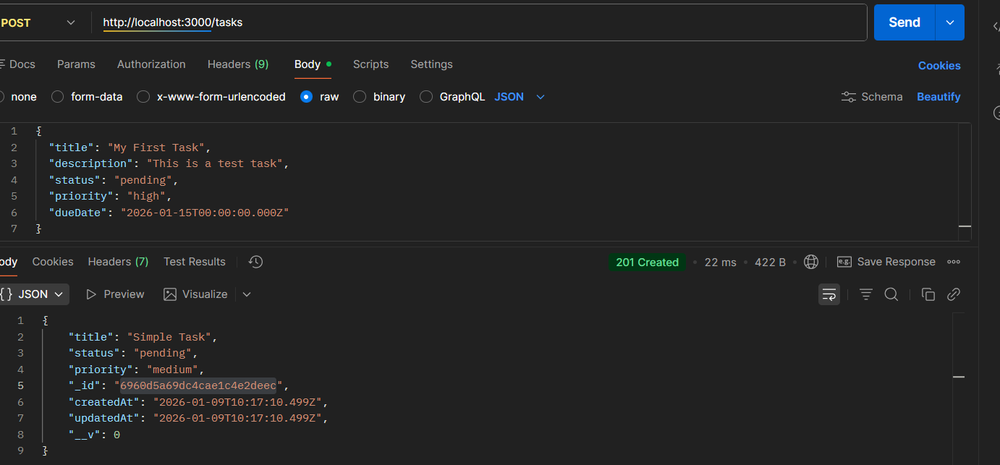
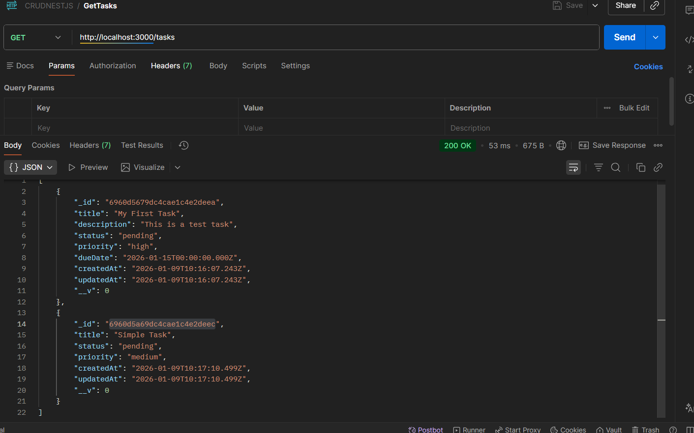
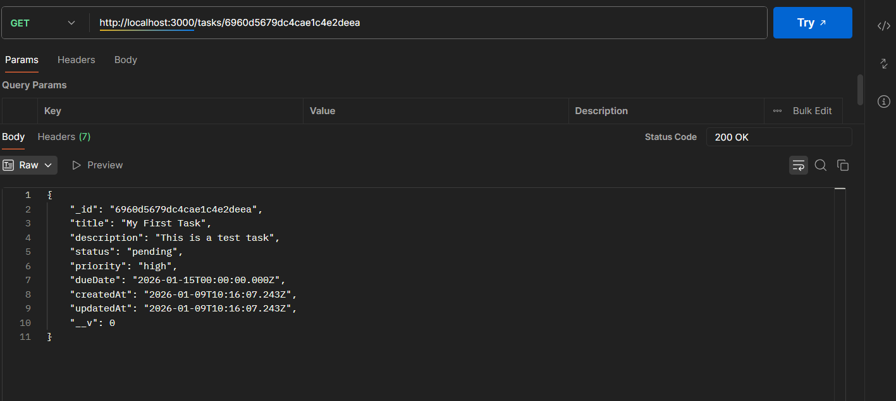
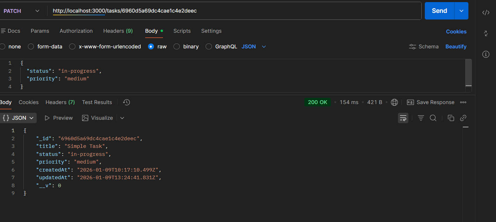
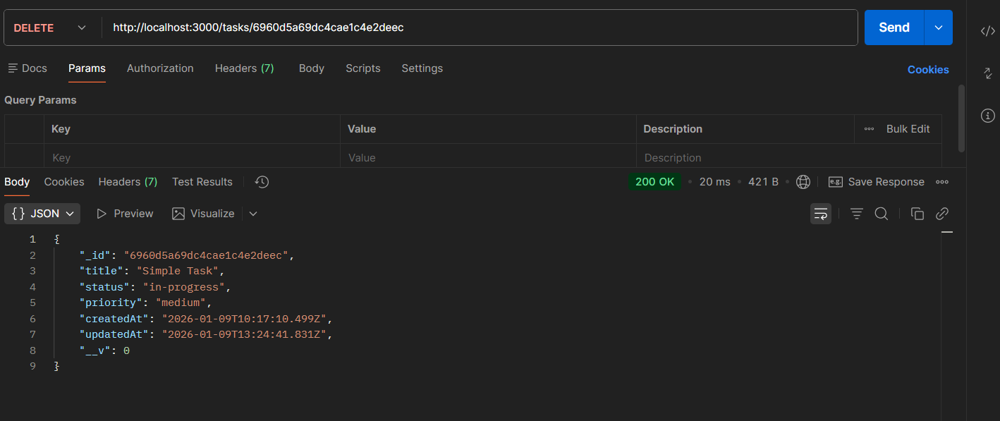

# NestCRUD - Task Management API

A RESTful API for task management built with NestJS, TypeScript, and MongoDB.

## Features

- Full CRUD operations for tasks
- Input validation with detailed error messages
- MongoDB integration with Mongoose ODM
- Environment-based configuration
- Automatic timestamps (createdAt, updatedAt)
- Task status and priority management

## Tech Stack

- **Framework:** NestJS 11
- **Language:** TypeScript 5.7
- **Database:** MongoDB with Mongoose 9
- **Validation:** class-validator & class-transformer

## Project Structure

```
src/
├── main.ts                    # Application entry point
├── app.module.ts              # Root module
├── app.controller.ts          # Root controller
├── app.service.ts             # Root service
└── tasks/                     # Tasks feature module
    ├── tasks.module.ts        # Module definition
    ├── tasks.controller.ts    # REST endpoints
    ├── tasks.service.ts       # Business logic
    ├── schemas/
    │   └── task.schema.ts     # MongoDB schema
    └── dto/
        ├── create-task.dto.ts # Create validation
        └── update-task.dto.ts # Update validation
```

## API Endpoints

| Method | Endpoint | Description |
|--------|----------|-------------|
| GET | `/` | Health check |
| POST | `/tasks` | Create a new task |
| GET | `/tasks` | Get all tasks |
| GET | `/tasks/:id` | Get task by ID |
| PATCH | `/tasks/:id` | Update a task |
| DELETE | `/tasks/:id` | Delete a task |

## Task Model

| Field | Type | Required | Default |
|-------|------|----------|---------|
| title | string | Yes | - |
| description | string | No | - |
| status | enum | No | `pending` |
| priority | enum | No | `medium` |
| dueDate | Date | No | - |

**Status Values:** `pending`, `in-progress`, `completed`

**Priority Values:** `low`, `medium`, `high`

## Quick Start

### Prerequisites

- Node.js v18+
- MongoDB (local or Atlas)

### Installation

```bash
# Install dependencies
npm install

# Configure environment
# Edit .env file with your MongoDB connection string
```

### Running the App

```bash
# Development mode (with hot reload)
npm run start:dev

# Production mode
npm run build
npm run start:prod
```

### Testing with Postman

See [SETUP_AND_TESTING_GUIDE.md](./SETUP_AND_TESTING_GUIDE.md) for detailed instructions.

## API Screenshots

### Create Task


### Get All Tasks


### Get Task by ID


### Update Task


### Delete Task


## Environment Variables

| Variable | Description | Default |
|----------|-------------|---------|
| MONGODB_URI | MongoDB connection string | `mongodb://localhost:27017/nestcrud` |
| PORT | Application port | `3000` |

## Scripts

| Command | Description |
|---------|-------------|
| `npm run start:dev` | Start in development mode |
| `npm run start` | Start the application |
| `npm run build` | Build for production |
| `npm run start:prod` | Run production build |
| `npm run test` | Run unit tests |
| `npm run test:e2e` | Run e2e tests |
| `npm run lint` | Run ESLint |

## License

MIT
